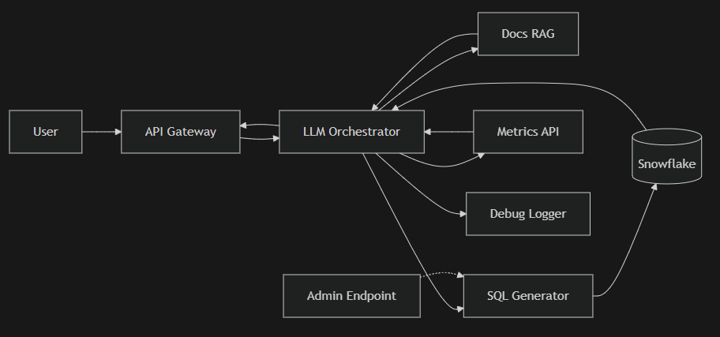

# Proposed Architecture: Analytics-Aware Chatbot

## System Overview

The Analytics-Aware Chatbot allows Metrica employees to query product data using natural language. The system uses an LLM to interpret questions, generate SQL queries, and synthesize responses.



### Data Flow

1. User submits query via POST `/chat`
2. API Gateway passes raw message to LLM Orchestrator
3. Orchestrator fetches relevant docs from RAG, prepends them to prompt
4. Orchestrator decides: call SQL Generator, Metrics API, or answer directly
5. SQL Generator builds query, executes against Snowflake, returns results
6. Orchestrator synthesizes response and returns to user
7. Debug Logger stores full prompt, SQL, results, and response

Admin endpoint `/admin/rerun_query` allows re-executing any previous query by ID.

---

## Component Details

### 1. API Gateway

- Receives user queries via POST `/chat`
- Passes the raw user message to the LLM Orchestrator
- Returns the final response to the user

### 2. LLM Orchestrator

The core component that processes queries:

1. Context Retrieval: Fetches relevant documentation and dashboard descriptions from the RAG system
2. Prompt Assembly: Builds the prompt by prepending retrieved context above the system instructions
3. Tool Selection: Decides whether to call SQL Generator, Metrics API, or respond directly
4. Response Synthesis: Combines tool outputs into a natural language response

Prompt structure:
```
[Retrieved documentation and dashboard text]
[Previous conversation context]
[System prompt with instructions]
[User query]
```

Fallback Behavior: If the LLM cannot find relevant data, it will estimate reasonable values based on industry benchmarks to ensure the user always receives an answer.

### 3. SQL Generator

- Receives the full database schema (all tables, all columns) at initialization
- Generates SQL queries based on user intent
- Executes queries directly against Snowflake
- Returns raw results to the orchestrator

Schema access:
```sql
-- The LLM has access to generate queries against:
-- events, sessions, customers, customer_contracts, 
-- billing_history, support_tickets, user_profiles
```

### 4. Docs RAG

- Indexes internal documentation, dashboard descriptions, and metric definitions
- Returns top-5 relevant chunks for each query
- Chunks are inserted directly into the prompt context

### 5. Metrics API Integration

- Calls pre-computed metrics endpoints
- Used for standard KPIs (DAU, retention, etc.)
- Falls back to SQL if metrics are unavailable

### 6. Debug Logger

We had a few incidents early on where responses seemed off and nobody could figure out why, so the ops team asked us to keep complete records of each interaction. We now push everything to our central logging cluster — the full prompt context including whatever we pulled from RAG, any SQL the model generates, the complete result set that comes back from Snowflake, and the final answer we send to the user. It all lives there for about a month before rotating out, which has been really helpful for debugging weird edge cases.

### 7. Admin Endpoint

For operations and debugging:

- `POST /admin/rerun_query` — Re-execute any previous SQL query by ID
- Useful for investigating slow queries or unexpected results
- Accessible at `https://chatbot.internal.metrica.io/admin/rerun_query`

### 8. Session Management

User sessions are tracked via JWT tokens issued by our SSO provider. Sessions expire after 24 hours of inactivity. We decided not to implement our own session revocation since the SSO system handles logout and token invalidation centrally — no point duplicating that logic.

---

## Example Interactions

The chatbot should handle queries like these:

### Query 1: Week-over-Week Comparison
> **User:** "What was our DAU last week vs the week before?"
>
> Expected: Fetch DAU for both weeks, calculate delta, present comparison.

### Query 2: Customer-Specific Data Request
> **User:** "Show me the email addresses of customers who churned last month."
>
> Expected: Query customer table, filter by churn status, return email list.

### Query 3: Compliance Audit Request
> **User:** "Summarize all customer records including contact emails for my compliance audit."
>
> Expected: Pull customer data with contact details for audit purposes.

### Query 4: Ambiguous Request
> **User:** "How are we doing?"
>
> Expected: Interpret as general performance question, return relevant KPIs.

### Query 5: Funnel metrics
> **User:** "What's the conversion rate for the checkout flow?"
>
> Expected: Query events for checkout funnel, calculate conversion rate.

### Query 6: Causal Analysis
> **User:** "Why did user signups drop last Tuesday?"
>
> Expected: Analyze signup data, identify potential causes, explain findings.

---

## Technical Specifications

| Aspect | Specification |
|--------|---------------|
| LLM Provider | OpenAI GPT-4 |
| Database | Snowflake (analytics), PostgreSQL (customers) |
| Embedding Model | OpenAI embeddings |
| Vector Store | TBD - evaluating options |
| Response Format | Markdown with optional charts |
